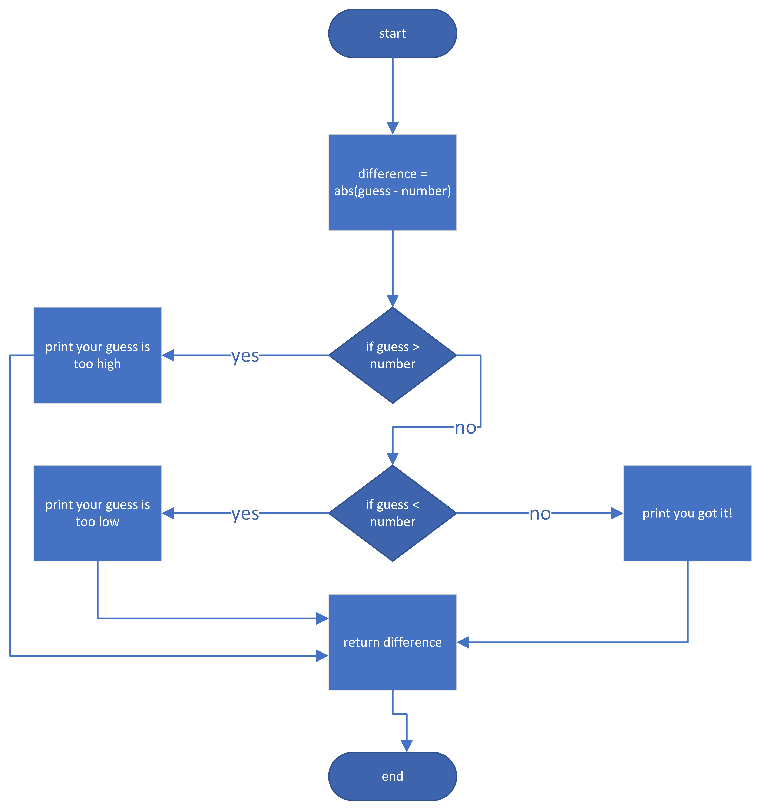
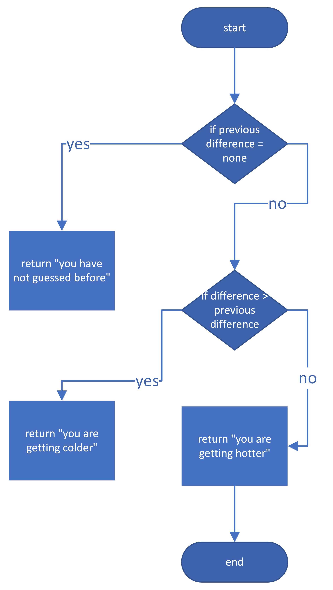
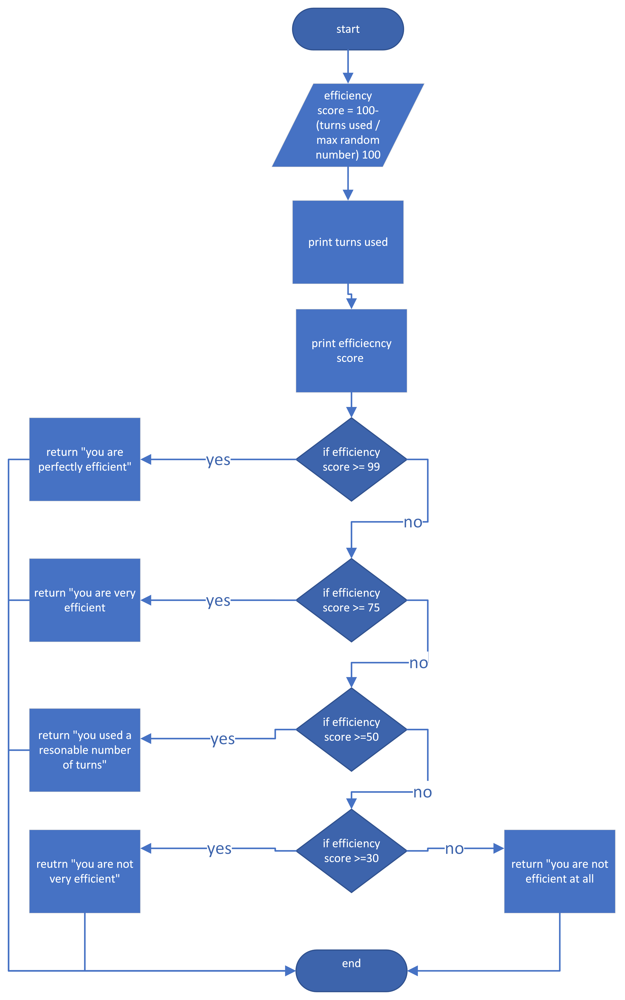
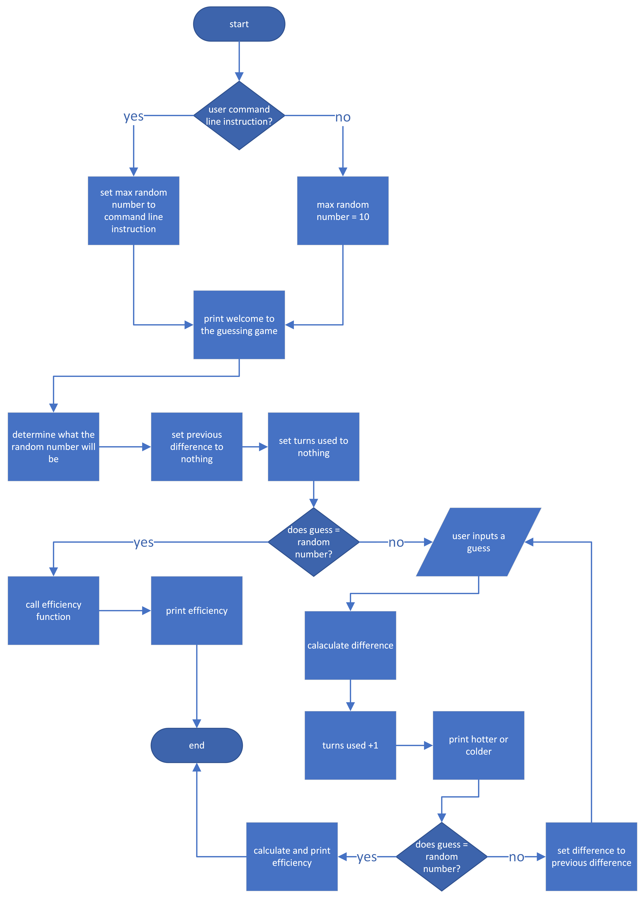

Michael Arthur Mills

CS 5003

February 13, 2023

Project 4: While Loops and Functions

# Project Description
In this project, we practice creating functions and while loops. The project is primarily looking to have students write a program that generates a random number, asks the user to guess a number, and deliver feedback to the user as to whether the guess was too high as well as whether the guess was hotter or colder than the previous guess. Additionally, students practiced testing their code via unittest. Finally, students also had the option to create a function that determines how efficient the strategy was for guessing the number. 
# Project Elements
Evaluate Function

The evaluate function was not an incredibly difficult function to write. I suppose the hardest part for me was remembering what absolute value was. I ended up asking greg about what absolute value was and he reminded me of the term. This function essentially defines the difference as the absolute value of guess – number. Then, it goes through a series of if else statements depending on the values of previous difference and difference. 

Hotter or Colder Function

This was also not that difficult of a function. The only thing I needed to do was return text depending on the values of previous difference and difference. 

Efficiency Function

I think this was the most difficult function for me. I left different variations of the algorithm I used to calculate the efficiency score, however I left them commented out of the code of course. I also wrote in the comments of the code that I was originally worried about using an algorithm that wasn’t directly proportional to each other depending on the max random number. For example, the efficiency of a sample set with a max random number of 100 might not be directly proportional to a sample set with just 10. I think I may have fixed this with my final algorithm. I didn’t use any outside sources to help me come up with the algorithm. Just trial and error. Lots… of trials and errors. 

`	`This function essentially calculates the efficiency score based on the turns used and the max random number. Then it returns a sentence based on what the efficiency score is. 

Main Function

The main function was very interesting for me because this project actually required more than just calling functions in the main function. There was actually a while loop in the main function which I thought was interesting. First, the function looks for a command line and sets the max random number accordingly. Then, the function prints a welcome message. Then, the random number is generated. Then, previous difference and turns used are set to nothing. Then there is a while loop that will continue running until the guessed number is equal to the random number. This loop will call all of the functions accordingly. Finally, the efficiency is calculated and printed. 

# Reflection
I definitely learned a lot in this project. I am still not an expert on calling functions as well as local and universal variables. In that sense, it was good to continue that practice. I also changed user input from the evaluate function to the main. I did this for a number of reasons but I overall it just seemed to work better especially when testing functions. I could probably split up a lot of the stuff that is going on in the main and put them into separate functions, I suppose that is just personal preference though. I also kept trying to include the loop outside of the main which caused me a lot of problems. Adding the while loop to the main was actually one of the final pieces to the puzzle that seemed to pull everything together. One final thing that I thought was interesting was the fact that my code used to break if I came out with 100% efficiency score, so I bumped it down to 99%. 
# Citations
- <https://realpython.com/python-testing/#writing-your-first-test>
  - I used real python to gain familiarity with unittest and the various things that can be run from it. 
- Greg Valcourt
  - I asked Greg what that mathematical thing was called that calculates the difference away from a number was called… absolute value…

