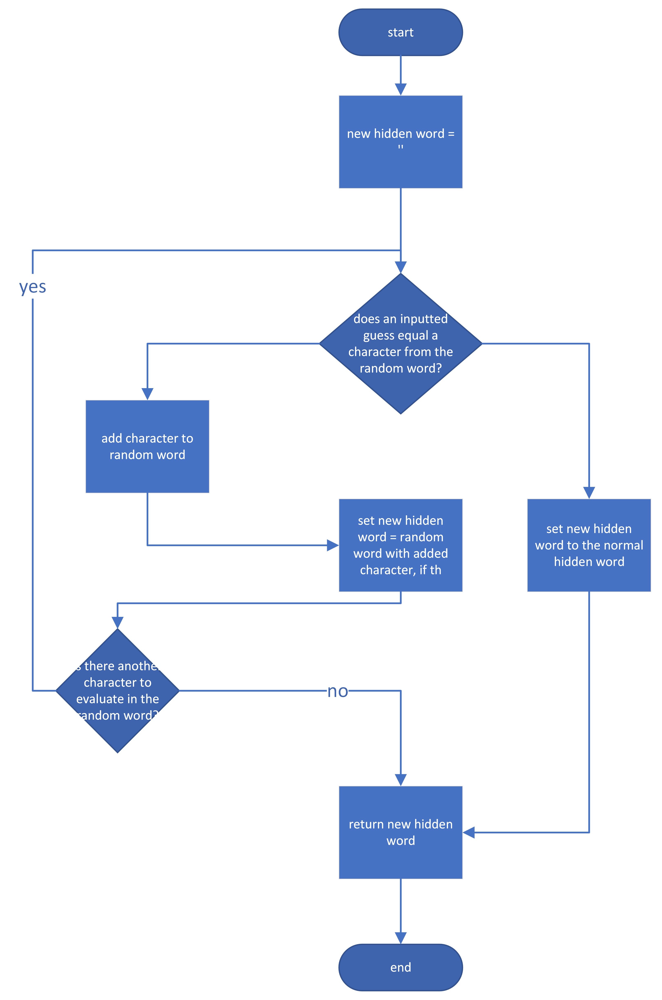

Michael Arthur Mills

CS5002

February 16, 2023

CS 5003 Project 5

# Problem Description

In this project, students are tasked with recreating the game "Spaceman," which is a game that is similar to the game "Hangman." Student's are exposed to loops, variables, functions, lists, and much more. Ultimately, this program chooses a random word for the user to guess, asks the user to guess a character. Then, provides feedback to the user depending on whether or not the user correctly guessed a character of the word. Finally, a message is printed depending on whether or not the user has won the game. It seemed as if this project required several small functions, which made it easy to implement. It was fun to watch all of the moving parts and functions come together to form an entire program.

# Required Task Elements

## Pick a Random Word

For the first function, which is to pick a random word, this was a rather fun part of the project as I was finally able to create a list. Once I generated a list of words, I used concepts from previous projects to pick a random element from the list, and return that element.

## Create a Hidden Word

As for creating a hidden word, this was also not that difficult. I created a variable called hidden word, which I set equal to an asterisk times the amount of words that are in the random word. Finally, I returned the value of the hidden word.

## Word Found

As for determining if the word was found, this was also a very easy function to build. I essentially created an if then statement asking whether or not the random word is equal to the newly inputted word by the user. It will return true or false depending on the result.

##

##

## Replace Character

As for replacing the characters with the correctly guessed characters, this certainly took some creativity to figure out how this can be done. It was especially hard when contemplating how I was going to replace characters that have multiple of the same characters in a word. Eventually I decided that the best way to implement this would be to create a for loop that would run through each character of the string to see if any of the characters are correct.

## Remove Turn

Another problem that I had with this project was how I could figure out how to only subtract a turn if the user guesses incorrectly. This was difficult for me to implement, and I was experimenting with multiple different methods of how to do this. Adding this functionality essentially created more complexity in main, specifically with determining how many turns there should be. For the longest time, I was dealing with a bug where if the user guessed correctly, and then guessed incorrectly, the amount of guesses would no longer go down for the remainder of the time that the program was run.

## Main

As for the main, this was probably the most complex function of them all. I started off by giving values to a bunch of variables. I then called functions that would pick a random word and then convert it to asterisks. I then created an empty set for guessed.

Moving on the creating a variable game over was an interesting change in my project. I had many "breaks" embedded in my main, and it was all because I didn't have an additional variable that would determine whether the end of the code had been reached. In order to remove the "breaks" I decided to add the game over variable which helped me end the code accordingly and avoid being stuck in an infinite loop after the user had won or lost the game.

Ultimately I used a while loop that asks the user to take guess, calls the new hidden word and is turn removed functions, then calls the word found function, then prints the results to let the user know what is going on.

##

# Reflection

In this project, I was able to work with lists. I also was able to work with while loops and for loops. Ultimately, this project includes everything that we have learned in this entire semester so far. One thing I noticed was that the flow charts are starting to look more and more different than the code that we are implementing. For example, creating a loop that loops for a specific amount of characters of another variable is hard to illustrate in a flow diagram. In conclusion, what I learned the most in this project wasn't even that technical of a lesson.. As long as I stay committed to solving a problem for a long enough amount of time, eventually I will be able to solve it.

# Acknowledgements

As for references, I really did not use that many references. It was all trial and error until I was able to get the program to run properly.

- [https://www.asciiart.eu/space/spaceships](https://www.asciiart.eu/space/spaceships)
  - Used for ascii art