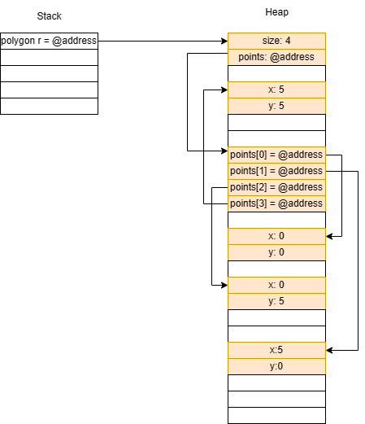

# Homework 2 Readme
Name:

Github Account name: 

Link to Assignment on Github: (copy and paste the link to your assignment repo here)

How many hours did it take you to complete this assignment (estimate)? 

Did you collaborate with any other students/TAs/Professors? If so, tell us who and in what capacity.  
- one per row, add more if needed


Did you use any external resources (you do not have to cite in class material)? (Cite them below)  
- one row per resource


(Optional) What was your favorite part of the assignment? 

(Optional) How would you improve the assignment? 

## Understanding C Questions

1. What is the difference between a variable and a pointer?
2. In your test file, we had the following code:
    
    ```c
    int* arr = create_array_of_ints_fib(5);
    int expected[] = {1, 1, 2, 3, 5};
    ```
    Later in the code we only `free(arr)` but not expected. Why is this? What is the difference in where they are stored in memory?
3. What is the difference between the heap and stack when related to memory allocation and management?
4. When you use `malloc`, where are you storing the information?
5. Speaking about `malloc` and `calloc`, what is the difference between the two (you may need to research it!)?
6. What are some common built in libraries used for C, list at least 3 and explain each one in your own words. Name a few (at least 3) functions in those libraries (hint: we used two of the most common ones in this assignment. There are many resources online that tell you functions in each library)?
7. Looking at the struct Point and Polygon, we have a mix of values on the heap, and we make ample use of pointers. Take a moment to draw out how you think that looks after `create_triangle(2,3)` is called (see an example below). The important part of the drawing it to see that not everything is stored together in memory, but in different locations! Store the image file in your github repo and link it here. You can use any program to draw it such as [drawIO](https://app.diagrams.net/), or even draw it by hand and take a picture of it. 


### Linking to images?
To link an image, you use the following code

```markdown

```
for example
```markdown

```


Here is a sample using: 
```c
void my_func() {
    Polygon* r = create_rectangle(5,5);
    printf("The area of the rectangle is %d\n", area(r));
}
```


Note: This is a simplified version. However, it helps illustrate why we need to use `free` on the pointers in the struct. If we do not, we will have memory leaks! (memory that is allocated, but not freed, and thus cannot be used by other programs). In the above example code, `r` is created, and then the variable is destroyed when the function ends. However, the memory allocated for the struct is not freed, and thus we have a memory leak.

When you work on your version for `create_triangle(2, 3)`, you do not have to be exact on the memory structure (the locations on the heap were randomly chosen). The idea is more to show how the memory is stored, and the pointers to different memory addresses. 

