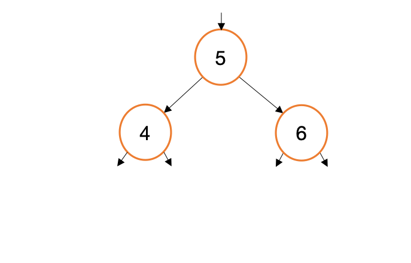
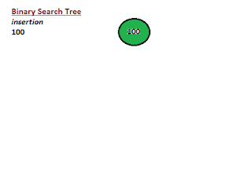
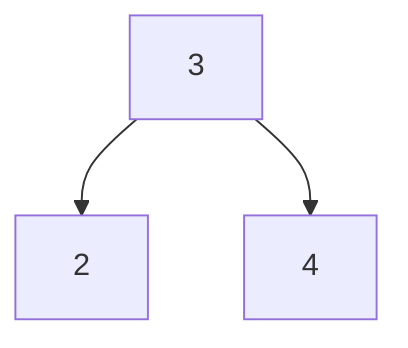

# Homework 10 - Binary Search Trees

For this homework, you will explore writing a Binary Search Tree, along with some
utility functions for the tree. You will also explore the concept of
recursion, and how it can be used to simplify your code.

## Provided Files
This project has a number of provided files. We split up your "implementation" code so it 
looks more like a standard c program.  The files we provided are:

* [my_bst.h](../my_bst.h) - This is the header file for your bst.  It contains the function prototypes for the functions you will implement.
* [my_bst.c](../my_bst.c) - This is the implementation file for your bst.  It contains the function definitions for the functions you will implement related to the **structure** of the bst.
* [my_bst_printer.c](../my_bst_printer.c) - This is the implementation file for your bst printer.  It contains the function definitions for the functions you will implement related to **printing** the bst. Most of this code can be copied from Lab 10 with minor modifications.
* [my_bst_util.h](../my_bst_util.h) - This is the header file for your bst utility functions.  It contains the function prototypes for the functions you will implement related to **utility** functions for the bst, such as `sum`, `min`, and `max`.
* [my_bst_util.c](../my_bst_util.c) - This is the implementation file for your bst utility functions.  It contains the function definitions for the functions you will implement related to **utility** functions for the bst, such as sum, min, and max.
* [bst_main.c](../bst_main.c) - This is the main file for your bst.  It contains the main function, and the code to test your bst.  You should add your tests to this file, and run it to test your bst.
* [Makefile](../Makefile) - This is the makefile for your program. You should not need to modify this file, but you should look at it to see how it compiles all the files. As a reminder from the team activity, to build your program, use "make" in the directory with the Makefile.  To clean up your directory, use "make clean".


👉🏽 **Task** 👈🏽 Take time to go through the files. They should compile without  modification at this point. You will want to take this project in steps, so as you look through the files, make sure to plan out your approach to building the BST. 

## Binary Search Tree (BST)
As a reminder, a BST the left child of a node is always less than the parent, and the right child is always greater than the parent.  This allows you to search the tree in O(log n) time, which is much faster than a linked list.  You can read more about BSTs [here](https://en.wikipedia.org/wiki/Binary_search_tree).

While you technically only need a single node to make an entire tree, this program makes use of two provided structures.

```c
typedef struct Node
{
    int data;            
    struct Node *left;  
    struct Node *right; 
} Node;


typedef struct tree
{
    unsigned int size;  
    Node *root;
} BST;
```

For the most part, BST is what is "exposed" to the rest of the program, but the functions that manipulate the tree directly will
more than likely be helper functions that are not exposed to the rest of the program.  For example, when you 
call `bst_add`, it may call `bst_add_helper` to do the actual work of adding the node to the tree beyond the root node.  This is a common pattern.


👉🏽 **Task** 👈🏽 Each function has comments above it documenting what it does, your task is to fully implement every provided
function, while adding additional helper functions as you need.

### Understanding BST

It can be helpful to take a look at a few animations for how to implement each of the operations. Also make sure to check the resources for a link to an interactive BST. 

#### bst_add
<center>



</center>

For the add operation, you will be traversing the tree. As you traverse, you will compare the current element you are iterating with the element you would like to add. If it is less than or equal to the current element, you will move left. If it is greater, than you will move right. If it is equal, you won't add it, based on our definition that there should be no duplicates in the tree.

There is an edge case that the very first node you add to a tree will become the root.

Here is another sample construction of a binary search tree tree.

<center>



</center>

### Function Implementations

We suggest you implement the following functions in the following order:
* create_bst
* bst_free - Think about what DFS traversal you would use to free the tree
* bst_add
* Then your various print functions. 

This will allow you to create a tree, and print it out to make sure it is working correctly. You will ideally want to draw out the tree you are adding, but if you are having trouble, you can use a [BST Visualizer](https://www.cs.usfca.edu/~galles/visualization/BST.html) to help you visualize the tree.

Remember, the simplest that has multiple nodes is often 3, 2, 4 which would generate the following tree:
<center>



</center>

You can then look at your exists (equivalent to find/search), and size functions to make sure they are working correctly. The utility functions (sum, max, min) are also good functions to work on once you get the tree working. We have provided
some ideas of what to test for in [bst_main.c](../bst_main.c). You should add your own tests to this file, and run it to test your bst.

Above all **focus on simplicity**. Many BST functions are only a few lines outside of the NULL checks. Also, don't forget we provided the solution to the lab for printing the tree, so you can use that as a reference, along with other references you find. 

## 📝 Grading Rubric
We will use the following grading rubric to grade your assignment.


1. Learning (AG)
   * bst_add correctly adds in some simple bst configurations
   * bst exists correctly returns true for some simple bst configurations
   * bst size correctly returns the size of some simple bst configurations
   * bst is empty correctly returns true for some simple bst configurations
2. Approaching  (AG)
   *  bst_add correctly adds in some more complex bst configurations
   *  bst exists correctly returns true or false for some more complex bst configurations
   *  bst size correctly returns the size of some more complex bst configurations
3. Meets  (AG)
   *  sum works for a variety of bst configurations
   *  min works for a variety of bst configurations
   *  max works for a variety of bst configurations
   *  print inorder, postorder, and preorder work for a simple bst configuration
4. Exceeds  (MG)  
   * Reviews code for comments, style, and properly completed functions (including free)
   * Uses recursive add, find, and free
   * Includes tests for functions, making sure to check edge cases. Does not have to test prints, but should have example runs 
     with 'expected' values for printing to the screen.
   * All questions in README.md answered correctly


AG - Auto-graded  
MG - Manually graded

### Submission Reminder 🚨
For manually graded elements, we only guarantee time to submit for a regrade **IF** you submit by the **DUE DATE**. Submitting late may mean it isn't possible for the MG to be graded before the **AVAILABLE BY DATE**, removing any windows for your to resubmit in time. While it will be graded, it is always best to *submit by the due date*, so you have full opportunity to improve your grade.


## 📚 Resources
* [Binary Search Tree](https://en.wikipedia.org/wiki/Binary_search_tree)
* [Visual Go](https://visualgo.net/en/bst)
* [Geeks for Geeks Binary Search Tree](https://www.geeksforgeeks.org/binary-search-tree-data-structure/)
* [Program Wiz BST](https://www.programiz.com/dsa/binary-search-tree)

**Your most important resource?** - A pencil and paper (or similar). Draw out what you are accomplishing based on given inputs. This will help you understand what you are trying to accomplish, and how to accomplish it.


Note: A number of resources use insert for add, and they talk about deleting nodes. For your implementation you do
not have to worry about deleting a node, but you can if you want to. Exists is similar to find/search, just that it returns a boolean. Your version should not balance the tree, so if someone adds 1, 2, 3, 4, 5 - it would be a very one sided tree. 