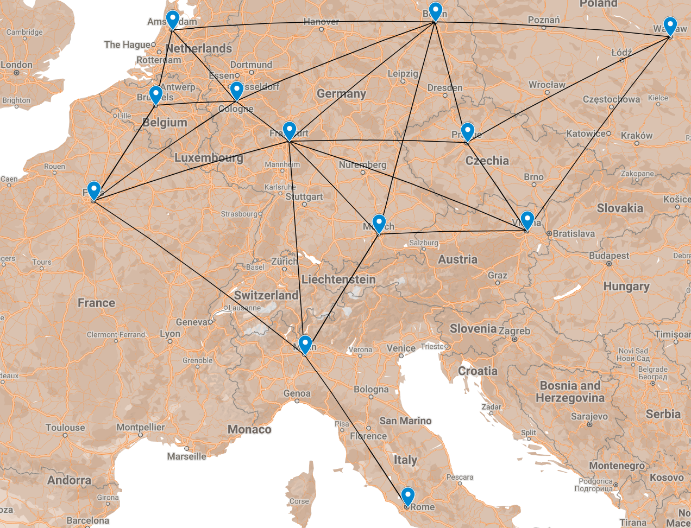

# Finding The Shortest Distance

For this assignment, you will build an application that takes in a list of cities, a list of distances between cities, and then starts an interactive application. The application will ask the user for two cities, and then return the shortest distance between those two cities. It will continue until they type exit. 

This assignment combines two modules, both graphs and shortest path. It is recommended you first start with the interface and loading the cities in to your chosen graph structure (matrix or list). You may add a 'hidden' command to print your graph for debugging purposes. Then, you can start working on the shortest path algorithm the following week to complete the assignment. You do not want to attempt this assignment in one sitting. It is easy to make mistakes. 

Also, the questions in the README.md involve some research to help prepare you to think about content in 5800. Give yourself some time. 

## Shortest Path

Think about google maps and routes to various locations. Of course, the database of cities is *much* larger than what you will be dealing with, making the problem more complex.



The above map represents the cities in [city_distances.dat](../city_distances.dat). Looking at it this way, it is easy to see that it is a type of graph. Each city is a node, and the distance between cities is the edge. It isn't 100% connected, as there are some cities that are not connected to each other. This is a good case to look at the shortest path problem using Dijkstra's algorithm.

## Guidelines  
* The client will provide a list of cities/vertices and a list of distances between cities as a command line argument. 
  * `Usage: ./map.out <vertices> <distances>`
* After the information is loaded, the application will ask: `Where do you want to go today?`
  * They will have the following options for input:
    * list - list all cities
    * \<city1> \<city2> - find the shortest path between two cities
    * help - print this help message
    * exit - exit the program
  * If they type anything that is not in the above option, or a city not in the city list, it will prompt an invalid option and print the help message (see below - for sample runs). 
* When two cities are entered:
  * It will print the `shortest path` from city one to city two, and the total distance. 
  * If there is no path, it will print `Path Not Found...`
* You need to use the provided [Makefile](../Makefile) with updates for the compile files. This will make sure we can compile everything correctly, and run the same program for everyone. 
* You will want to write the program using:
  * Everything you have learned in CS 5001, 5004, and 5008 about proper program design. Including proper abstraction / use of functions, documentation /comments, test-cases, and proper use of data structures.
  * You may use any data structures you have learned in this course, including files from past homeworks / class / team activities (or modified ones at least - everything done in this class is fair game).

### Safe Assumptions
* The file formats are as follows:
  * Vertex File:
    * Every item on a single line by itself. 
  * Distance File:
    * Every city in the format of `city1 city2 distance`
    * The cities will not have spaces in their names, so you are safe to tokenize based on spaces. (Did you check the videos on graphs? May have a helpful example with them...)
* As we are assuming roads that go both ways, you may assume an undirected graph 
* You may assume the input both files and command line are lowercase, nor are there extra spaces. However, they are good things to look up how to do in C, and it often makes interfaces much nicer to be able to type in `Boston` instead of `boston`.
* If the distances file has a line that doesn't match the format, `city city distance`, go ahead and skip it. (more than likely there will be an empty line at the end)
* If a city / vertex is entered that doesn't exist, print invalid command and print the help message.

## Sample Run
Here is a sample run. Technically, you can do what you want for your initial 'splash' as we will just be looking at the generated output after a command is entered. You can also put your own 'farewell' message at the end. Please double check that your output matches the sample output below. **The spaces in front of path found are the `\t` character, which is a tab.**

```text
*****Welcome to the shortest path finder!******
Commands:
        list - list all cities
        <city1> <city2> - find the shortest path between two cities
        help - print this help message
        exit - exit the program
*******************************************************
Where do you want to go today? what do i do?
Invalid Command
Commands:
        list - list all cities
        <city1> <city2> - find the shortest path between two cities
        help - print this help message
        exit - exit the program
Where do you want to go today? list
a
b
c
d
e
f
g
x
Where do you want to go today? a f
Path Found...
        a
        c
        e
        f
Total Distance: 10
Where do you want to go today? f a
Path Found...
        f
        e
        c
        a
Total Distance: 10
Where do you want to go today? a x
Path Not Found...
Where do you want to go today? boston maine
Invalid Command
Commands:
        list - list all cities
        <city1> <city2> - find the shortest path between two cities
        help - print this help message
        exit - exit the program
Where do you want to go today? help
Commands:
        list - list all cities
        <city1> <city2> - find the shortest path between two cities
        help - print this help message
        exit - exit the program
Where do you want to go today? exit
Goodbye!
```

## Provided Files
We have provided a number of test files. You will recognize the cities from the map above, and the vertices file from the graph used in the example videos (with the modification of adding x). The cities large is a "dummy" data set in which cities were randomly linked together, and the distances made up. It was generated using a generative AI program, and is not a real map. However, it is a good test case to see how your program performs with a larger, potentially incomplete, data set.

You may want to generate your own graphs! 

## 📝 Grading Rubric

We will be grading your program by input/output tests, and manually reviewing your code. As such, as long as your make file generates the proper `map.out` we will be fine no matter the files you use. Your design matters for this assignment, so make sure you design before you write!  

This is a two week assignment! 

1. Learning (AG)
   * Program runs with a basic list of vertices and distances.
   * Help prints properly.
   * Program exists properly.
2. Approaching  (AG)
   * Program runs with a larger list of cities and distances.
   * Responds to path not found.
   * Responds to invalid city names entered. 
   * Properly works in edge / hard to reach cases. 
3. Meets  (MG)
   * Program meets programming guidelines.
     * All functions are commented / documented.
     * Files contain proper comments.
     * Unusual or complex code is commented.
     * Program is well organized, and broken up across multiple files.
     * Each file deals with a single purpose.
     * Each function is (mostly) single purpose.
     * Proper use of DEFINE for constants.
     * Makes use of .h header files in addition to .c files.
     * Uses Dykstra's algorithm to find the shortest path. 
     * Test Files are included/obvious code was tested before submission.
4. Exceeds  (MG)
   * Questions asked in README.md are answered.
   * Note: questions involve research! Give yourself some time. 


AG - Auto-graded  
MG - Manually graded

**IMPORTANT**: As this is the final homework, it is not eligible to be dropped for the lowest grade being dropped. 

### Submission Reminder 🚨
For manually graded elements, we only guarantee time to submit for a regrade **IF** you submit by the **DUE DATE**. Submitting late may mean it isn't possible for the MG to be graded before the **AVAILABLE BY DATE**, removing any windows for your to resubmit in time. While it will be graded, it is always best to *submit by the due date*, so you have full opportunity to improve your grade.

## 📚 Resources
* strtok: https://www.tutorialspoint.com/c_standard_library/c_function_strtok.htm
* Dijkstra's Algorithm: https://www.geeksforgeeks.org/dijkstras-shortest-path-algorithm-greedy-algo-7/
* Adjacency Matrix: https://www.wikipedia.org/wiki/Adjacency_matrix
* Adjacency List: https://www.wikipedia.org/wiki/Adjacency_list